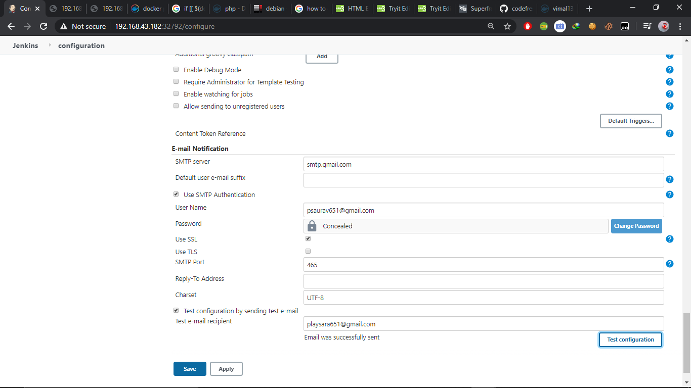

# Devops-fully_automate
# Problem Statement

1.	Create container image that’s has Jenkins installed  using dockerfile 

2.	When we launch this image, it should automatically starts Jenkins service in the container.

3.	Create a job chain of job1, job2, job3 and  job4 using build pipeline plugin in Jenkins 

4.	 Job1 : Pull  the Github repo automatically when some developers push repo to Github.

5.	 Job2 : By looking at the code or program file, Jenkins should automatically start the respective language interpreter install image container to deploy code ( eg. If code is of  PHP, then Jenkins should start the container that has PHP already installed ).

6.	Job3 : Test your app if it  is working or not.

7.	Job4 : if app is not working , then send email to developer with error messages.

8.	Create One extra job job5 for monitor : If container where app is running. fails due to any reson then this job should automatically start the container again.

## My Solution for this problem is:
 

### Initial steps:

* Create the repository from where developer will push the code.

* Configure the hooks so that whenever the developer commit the code it will automaically puch the code to github.


### Step 1: Creating the jenkins installed image:


* Here we are using the centos as the base os for the jenkins.


* After creating the Dockerfile run this command

```
docker build -t jenkins:v1 .
```


### Step 2: Automatically starts the jenkins services:


* After build of the image launch the OS with taht image 

```
docker run -itd -v /root/11may/jenpass/:/root/.jenkins/secrets/ -v /var/run/docker.sock:/var/run/docker.sock --name jenpro -P jenkins:v1
```

* /root/11may/jenpass is my host folder where i am storing the initial password of jenkins

* /var/run.docker.sock to run the docker inside the docker using docker socket

* -P for the random port number as i have exposed the port number in Dockerfile


### Step 3: Creating the job chain using build pipeline:


### Step 4: 


#### JOB 1: Pulling the repo.:


### Step 5: 


#### JOB 2: Looking the type of file it will automatically launch the required OS in the docker. Here we have use the concept docker inside docker as jenkins is also running inside the docker.


### Step 6 & 7: 


### JOB 3 & 4: Testing the app if it is not working then it will fail and send the email to the developer about the failures of the code.


* For sending the mail using jenkins follow the steps:

1.Go to "Manage Jenkins" and select the "Configure System"


2.Scroll down and find the "jenkins locations" and fill the details

3.Now finds the "E-mail Notification" and write smtp.gmail.com


4.Go to Advanced..


5.Fill the details accordingly

6.You can also test it is working or not



* Note: For this your gmail security should be off.


7.Now configure jenkins job for notification


* Here I have manually written the wrong code and it fails.


### Step 8: Now the final job comes. It will monitor the continers running, if they fails or stops by any reasons then this job will autmatically starts or launch the OS within a sec with the same confirguration.


## Built With

* RHEL-8 Running in Virtual Box
* Docker
* Git & GitHub
* Jenkins

## Author

[SAURAV PATEL](https://www.linkedin.com/in/saurav-patel-148539151/)
